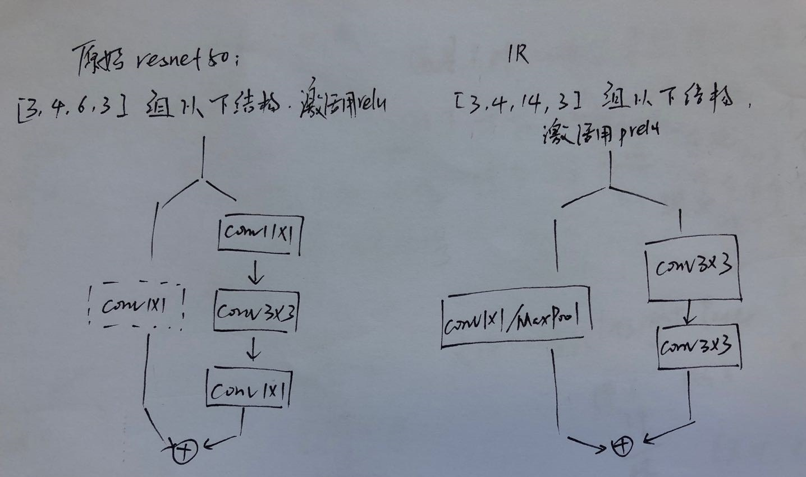

# pytorch 版人脸识别 from ZhaoJ-face.evoLVe  
#### 环境  
pytorch 1.1.0 ~ 1.3.0 确定可行，其他版本只要能跑也可  
dali 参考[官方](https://docs.nvidia.com/deeplearning/sdk/dali-developer-guide/docs/installation.html)安装，最新版本会报警告，不影响使用  
其他pip install 安装  
#### 执行  
sh m2.sh  只要机器能访问/ai_data/应该可以直接跑，MobilenetV2训练  
提供log文件backup/MobileV2_03_12-16_29.log 以供参考  
- 训练自己的数据：  
--data-root 改成自己的路径，--num-classes 改成自己路径下的类别数  
要注意的地方：  
1. 默认路径名字是data_100,存放方式如下，可以修改myTrainDali.py第67行改为自己的路径
data_100  
|-class00  
|-class01  
|-......  
|-class99  
2. 每个类别放在同一个子路径下，路径下不宜出现图片之外的其他格式数据

#### tricks   
Softmax比其他花式loss收敛快  
lr=0.1没有warmUp的话不收敛  
lr=0.1 + warmUp最后精度比直接用lr=0.01高   
#### 结构  

- resnet是原始resnet网络  
- IR是insightface里的resnet
#### 训练  
    python train.py 2>&1 | tee ../py-log/`date +'%m_%d-%H_%M_%S'`.log  
- train_prefetch.py是加入[trick_2](http://zhuanlan.zhihu.com/p/68191407)cuda预取的，加速效果没有作者说的那么明显  

- tri_train.py 用triplet loss训练  
- tri_hard_train.py 加入难样本  
  ArcFace训练lr=0.1需要加warmUp,对小模型加WarmUp也难收敛，可先Softmax训几个epoch再fintune  

#### 测试  
- utils/test_ja.py 测试  

#### TODO  
  网络初始化  
